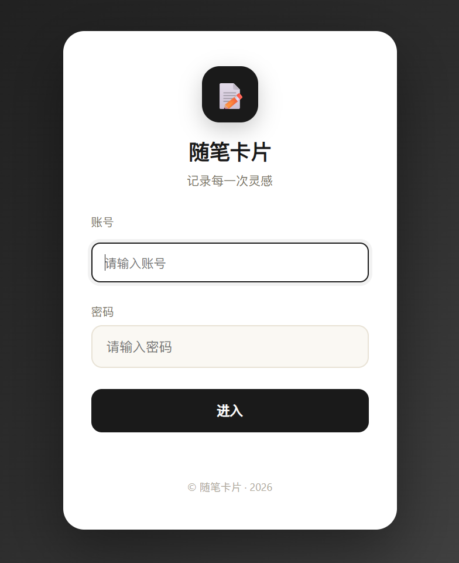
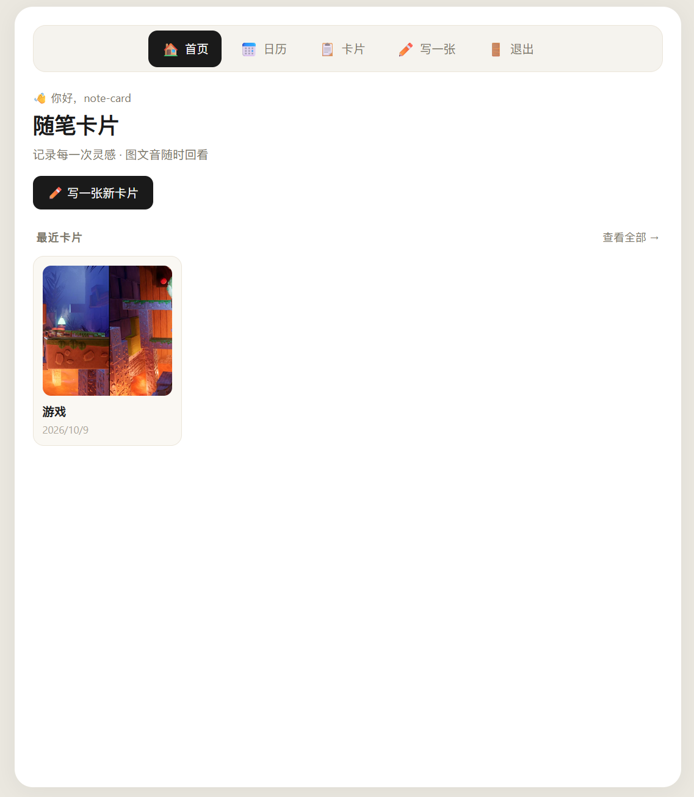
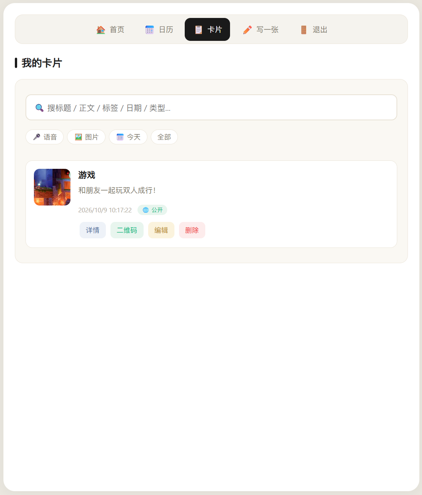
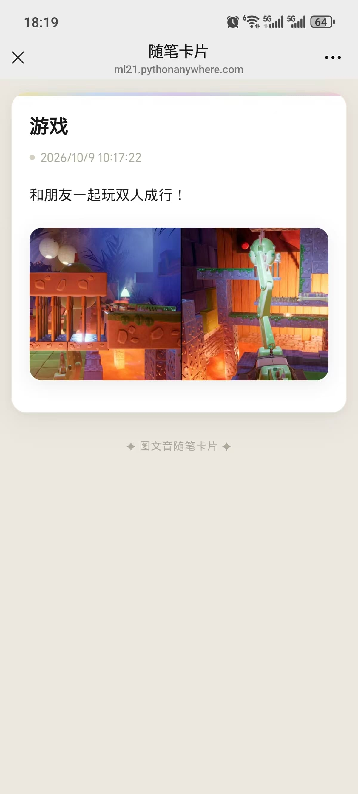

# 📝 图文音随笔卡片 · Note Card

> 一个轻量的图文音多媒体随笔记录工具。用一张「卡片」记录一次灵感，扫码即可分享。

[](https://www.python.org/)
[](https://flask.palletsprojects.com/)
[](LICENSE)

---

## 📖 项目简介

**随笔卡片** 是一个自部署的轻量级图文音记录工具，用来解决碎片化灵感记录与快速分享的问题。

- **记录**：文字 + 图片 + 录音，一张卡片承载一次完整表达
- **整理**：标签分类 + 全文检索，随时找到过往内容
- **分享**：公开卡片生成二维码，手机扫码即看，无需安装 App
- **掌控**：代码、数据都在自己手上，不受第三方平台限制
- **多用户**：支持多账号登录，数据互相隔离

线上演示：<https://ml21.pythonanywhere.com>

> ⚠️ 演示站点由 PythonAnywhere 免费版托管，若长期未访问可能会被暂停。

---

## ✨ 功能特性

### 多媒体记录
- 📝 文字卡片：标题 + 正文
- 🖼️ 图片上传：支持浏览器端自动压缩（体积减少约 70%），单张卡片最多 9 张
- 🎤 录音功能：基于 MediaRecorder API，浏览器直接录制
- 👀 实时预览：图片、录音上传前即可预览
- 🏷️ 标签系统：一张卡片可打多个标签
- ✍️ 纯文字 / 纯图片 / 纯语音 均可独立成卡

### 管理能力
- 🔍 全文检索：按标题、正文、标签、日期、内容类型搜索
- 🗂️ 标签筛选：按标签快速过滤卡片
- 🖼️ 缩略图列表：卡片列表带图片缩略图或语音波形图标
- 🎯 详情轮播：图片 → 文字 → 语音的横向轮播查看
- 📅 日历视图：按天查看创作记录
- ✏️ 编辑 / 删除：随时修改或移除卡片

### 分享与安全
- 📱 二维码分享：公开卡片一键生成二维码
- 🔐 多账号系统：基于 Flask Session 的登录认证，不同用户数据隔离
- 🌐 公开页免登录：卡片分享页无需登录，扫码即看
- 🔒 公开 / 私密开关：每张卡片可独立控制是否公开

### 部署与体验
- ☁️ 云端部署：无需本地开机，7×24 小时在线
- 🔐 HTTPS：PythonAnywhere 自动配置证书
- 📱 移动端适配：手机浏览器可直接使用
- ⚡ 零框架前端：加载快、代码易读易改

---

## 🖼️ 界面预览

### 登录页


### 首页


### 卡片列表


### 卡片分享页


---

## 🛠️ 技术栈

| 层次 | 技术 |
|------|------|
| 前端 | 原生 HTML / CSS / JavaScript（无框架依赖） |
| 后端 | Python 3.13 + Flask 3.x |
| 数据库 | SQLite |
| 认证 | Flask Session + HTTP Cookie |
| 依赖 | Flask-CORS |
| 部署 | PythonAnywhere |
| 关键 API | MediaRecorder API、Canvas API、QRCode.js |

---

## 📁 项目结构

```
note-card/
├── app.py                      # Flask 主程序
├── config.py                   # 敏感配置（不上传，见 .gitignore）
├── requirements.txt            # Python 依赖
├── .gitignore                  # Git 忽略规则
├── README.md                   # 项目说明（本文件）
├── LICENSE                     # 开源协议
├── database.db                 # SQLite 数据库（自动生成，不上传）
├── uploads/                    # 图片和音频文件（自动生成，不上传）
│   └── .gitkeep
├── docs/                       # 界面截图
│   ├── screenshot-login.png
│   ├── screenshot-admin.png
│   ├── screenshot-list.png
│   └── screenshot-card.png
└── public/                     # 前端页面
    ├── index.html              # 管理界面
    └── card.html               # 卡片分享页
```

---

## 🚀 快速开始

### 环境要求

- Python 3.10 及以上（推荐 3.13）
- pip

### 1. 克隆仓库

```bash
git clone https://github.com/ML02-cmd/note-card.git
cd note-card
```

### 2. 创建虚拟环境

```bash
# Windows
python -m venv venv
venv\Scripts\activate

# macOS / Linux
python3 -m venv venv
source venv/bin/activate
```

### 3. 安装依赖

```bash
pip install -r requirements.txt
```

### 4. 配置账号

在项目根目录创建 `config.py`，填写允许登录的账号：

```python
# config.py
USERS = {
    "admin": "你的强密码",
    "friend": "朋友的密码",
}
```

### 5. 启动服务

```bash
python app.py
```

浏览器打开 <http://localhost:3000>，使用上面配置的账号登录即可进入管理界面。

---

## 🔌 API 接口

| 方法 | 路径 | 说明 | 认证 |
|------|------|------|------|
| POST | `/api/login` | 用户登录 | ❌ 公开 |
| POST | `/api/logout` | 退出登录 | ❌ 公开 |
| GET | `/api/me` | 获取当前用户信息 | ❌ 公开 |
| POST | `/api/note` | 创建卡片 | ✅ 需要 |
| GET | `/api/note/list` | 获取卡片列表（仅自己的） | ✅ 需要 |
| GET | `/api/note/<id>` | 获取单条卡片（公开） | ❌ 公开 |
| GET | `/api/note/<id>?admin=1` | 获取单条卡片（含私密） | ✅ 需要 |
| PUT | `/api/note/<id>` | 修改卡片 | ✅ 需要 |
| DELETE | `/api/note/<id>` | 删除卡片 | ✅ 需要 |
| GET | `/uploads/<filename>` | 访问图片 / 音频 | ❌ 公开 |

认证方式：基于 Flask Session（Cookie）。

---

## ☁️ 部署到 PythonAnywhere

1. 注册 [PythonAnywhere](https://www.pythonanywhere.com/) 免费账户
2. 通过 **Files** 页面上传 `app.py`、`config.py`、`public/` 文件夹
3. 在 **Consoles → Bash** 中创建虚拟环境：

   ```bash
   cd ~/你的项目目录
   python3.13 -m venv venv
   source venv/bin/activate
   pip install flask flask-cors
   ```

4. 在 **Web** 页面创建 Flask 应用，配置：
   - Python 版本：3.13
   - Virtualenv：`/home/你的用户名/项目目录/venv`
   - WSGI 文件中加入：`path = '/home/你的用户名/项目目录'`
5. 点击 **Reload** 即可访问

> 免费版限制：每 3 个月需登录一次续期；磁盘 512 MB。

---

## 🗺️ Roadmap

- [x] 多媒体卡片（文字 / 图片 / 录音）
- [x] 多图上传（最多 9 张）
- [x] 图片 Canvas 压缩
- [x] 标签系统 + 全文检索
- [x] 二维码分享
- [x] 多账号登录 + 数据隔离
- [x] 日历视图
- [x] 首页视图 + 卡片网格
- [x] 云端部署 + HTTPS
- [x] 详情轮播（图 → 文 → 音）
- [ ] 编辑时支持替换图片 / 录音
- [ ] 卡片导出为 PDF / 图片
- [ ] 定时自动备份数据库
- [ ] 绑定自定义域名

---

## 🤝 贡献

项目目前是个人自用工具，但欢迎提 Issue 和 PR。

1. Fork 本仓库
2. 创建你的分支：`git checkout -b feature/xxx`
3. 提交更改：`git commit -m "feat: 新增 xxx"`
4. 推送分支：`git push origin feature/xxx`
5. 提交 Pull Request

---

## 📄 License

本项目采用 [MIT License](LICENSE) 开源。

---

## 🙏 致谢

- [Flask](https://flask.palletsprojects.com/)
- [PythonAnywhere](https://www.pythonanywhere.com/)
- [QRCode.js](https://github.com/davidshimjs/qrcodejs)

---

## 📮 联系方式

- 作者：ML02-cmd
- 项目地址：<https://github.com/ML02-cmd/note-card>